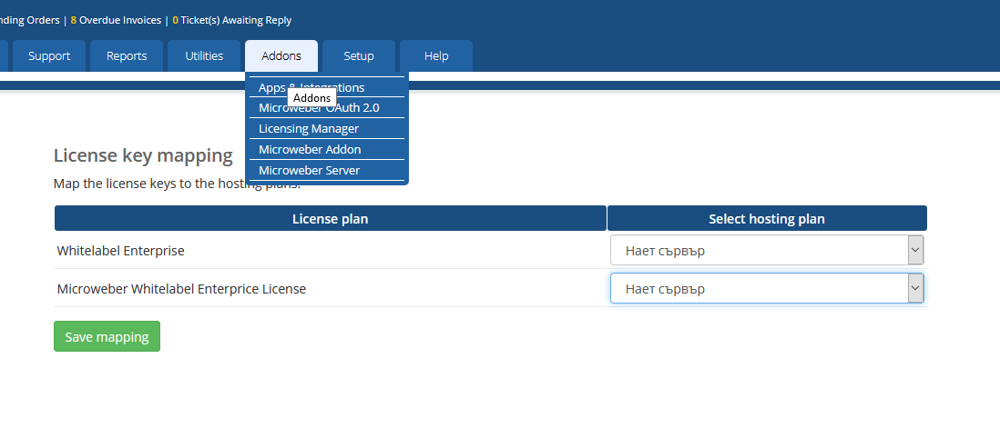

# WHMCS SERVER

 How to install?
 
 1.Download this repo.
 
 2.Open the whmcs main directory.
 
 3.Unzip the repo in /modules/addons/microweber_server/
 
 4.Activate the addon on admin.
 
 5.Open the url /admin/addonmodules.php?module=microweber_server
 
 6.Map the License Plans with Hosting Plans.
 

